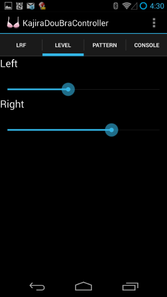
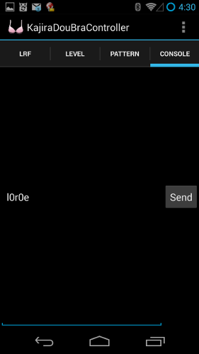

# kajiradoubra 可程式遙控震動胸罩
=================================

## 自我審查 十八禁 Adults only.

Please don't scroll down if you are under age of 18.

如果您未滿十八歲, 請勿繼續往下捲動.

Please close the window immediately if you are under age of 18.

如果您未滿十八歲, 請立刻關閉視窗.

# 哼哼 向東瀛女優國致敬

## 說明

本計畫為一可穿戴式設備. 透過手機藍芽遙控設備震動.

設備端為胸罩, 外加兩個小型震動馬達. 使用 Arduino 控制.
Arduino 連接藍芽模組. 並用 motor driver 控制震動馬達.

手機為 Android 手機, 安裝我們做的 app, 透過藍芽來遙控 Arduino.

## 玩法

此產品提供多種有趣玩法. 可自行 DIY 更多玩法. 歡迎分享 idea.

首先, 手機必須與胸罩藍芽裝置配對.
胸罩藍芽裝置預設名稱是 KajiraDouBra 密碼預設是 1234

然後安裝胸罩控制 app.

然後穿上胸罩. 並開啟 app 操作胸罩.

### 胸部按摩

本產品總共提供 36 段強度控制. 透過手機 app
介面可以任意調整自己覺得最舒服的強度.
每天按摩胸部 5 分鐘聽說還可以變大.
多愛自己一點多多按摩.

### 變頻震動

如果覺得單一強度震動太無聊. 目前手機 app 提供多種變頻震動.
列舉如下:
 * FF 水晶震動: 從左到右, 再由右到左, 讓您回味無窮
 * 愛的鼓勵: 給自己一個愛的鼓勵
 * ...

### 摩斯電碼

朋友可以用手機送摩斯電碼給您. 您不用用耳朵接收. 用胸部接收就可以了.

另外也可以拿來訓練自己摩斯電碼的解碼能力. 業餘無線電人員二級執照會考.

### 奴隸控制 (BDSM)

> 在人偶的製作材料中加入活體，該人偶就會被稱為禁忌人偶

1. 首先, 你需要一個奴隸 (submissive).

2. 然後把她戴上眼罩 如圖所示
 

3. 命令: 如果左邊震動, 就原地左轉. 如果右邊震動, 就原地右轉. 如果兩邊都震動, 就向前進

4. 你得到了一個以活人為零件的遙控式雙足步行機器人.

### Programmer mode

自己編寫 code. 創造自己的震動模式. 控制碼如下:

 * l{0-9A-Z}: 左馬達 36 段強度控制. l0 為停止震動. lZ 為最強震動
 * r{0-9A-Z}: 同上, 控制右馬達
 * s{0-9A-Z}: 延遲多少 n*0.1 秒. 0: n=0, 9: n=9, A: n=10, Z: n=35
 * e: 停止程式

範例:

 * l0rZ 左邊停止右邊震動
 * l0r0sAlZrZsA 停止一秒. 震動一秒, 反覆循環
 * l0r0s5lZrZs5l0r0s5lZrZs5l0r0e 震動兩次後停止

## 如何製作 HOWTO

### android app

 1. 裝好該裝的 android sdk 及 dependencies.
 2. 程式在 android/kajiradoubra-controller 子目錄中
 3. 在該子目錄執行 env ANDROID_HOME='你的 android sdk 目錄' ant debug
 4. 執行 adb install -r bin/KajiraDouBraController-debug.apk 安裝到手機上

### arduino

 * 建議直接購買 Arduino UNO.
 * 我是用自己做的 Arduino Severino. 但成本已大於直接上淘寶買的副牌 UNO.

 [!Arduino Severino](images/IMG_20150208_025002.jpg)

### shield

 Arduino 上的 shield. 基本上就是用 motor driver L293D
 控制兩個震動馬達的簡單電路.

 Parts 列表:
 * 一顆 L293D
 * 一顆 7805 regulator, 輸出 5V 用
 * 兩個電容器穩壓用. 分別接 VCC-GND 及 5V-GND. 我是用 4.7uf 的積層電容.
 * 一些 2.54mm 長排針用來連接 arduino
 * 4-pin 母座用來插 HC-06 藍芽模組.
 * HC-06 藍芽模組
 * 一個 10k ohm 電阻在 HC-06 的輸入端 RX 用來限流.

#### schematic

   7805 從 arduino 上的 Vin 輸入電壓. 輸出 5V 給 motor 用.

   Arduino 的 3, 5 pin 接到 L293D 的兩個 EN.
   因為 3, 5 pin 可以輸出 PWM, 就可以控制震動大小.
   而 10/11 pin 則是設成 serial 來連接 HC-06
   
   
 
#### 洞洞板 layout

   - 藍色的線是底部銲錫那面的線.
   - 紅色的線是跳線

   
   

